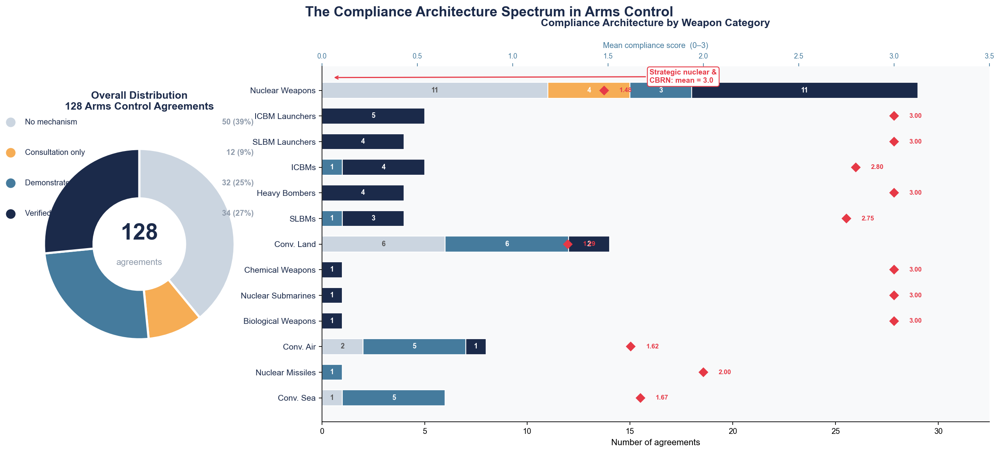
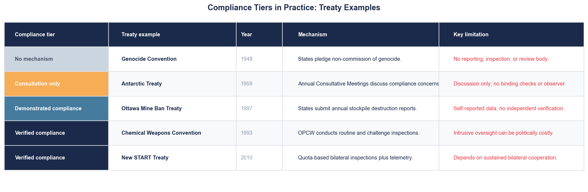
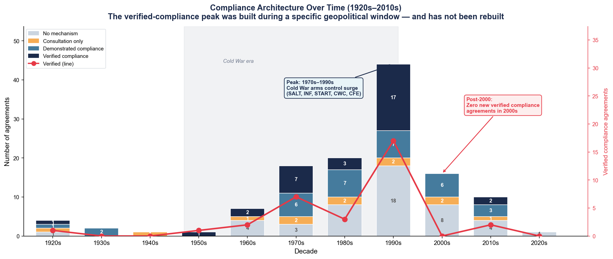
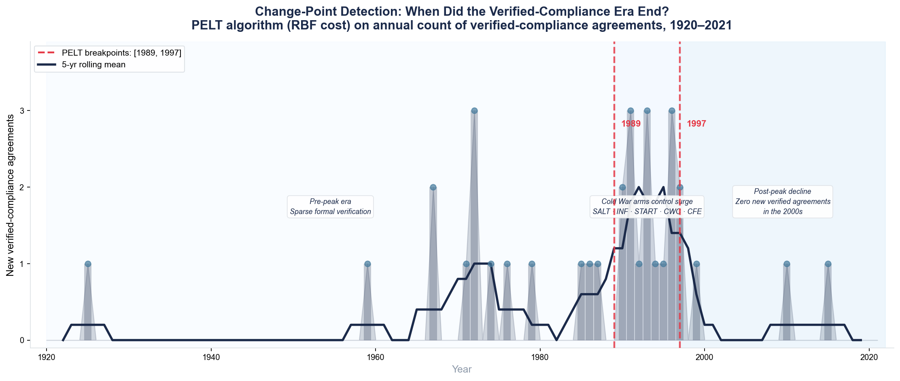
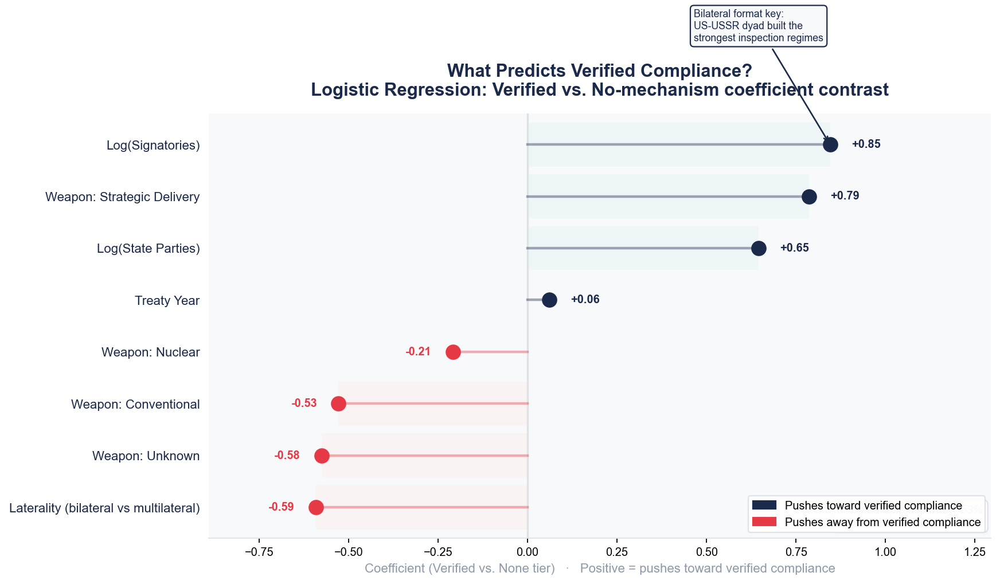
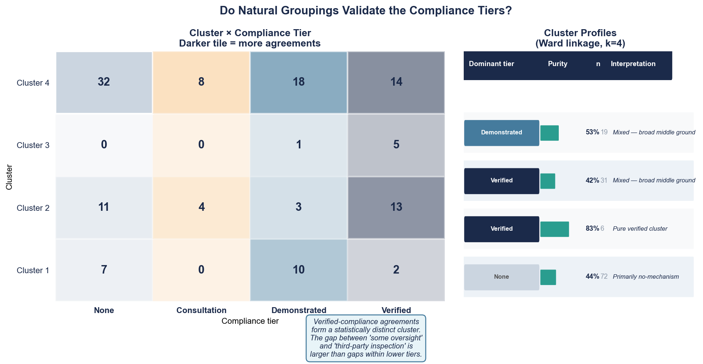
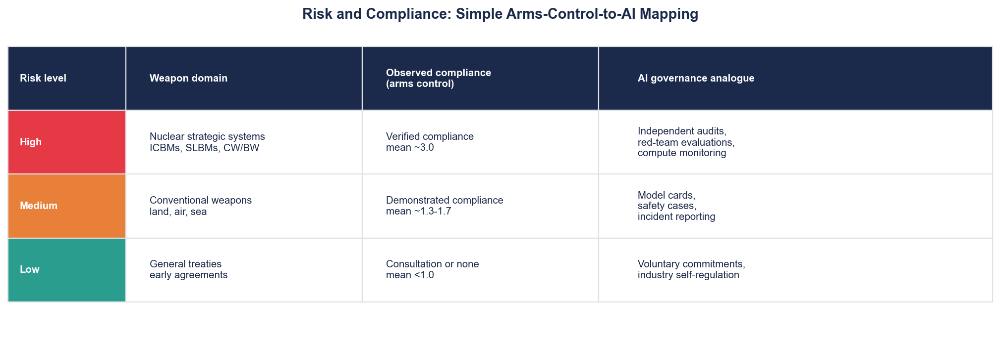
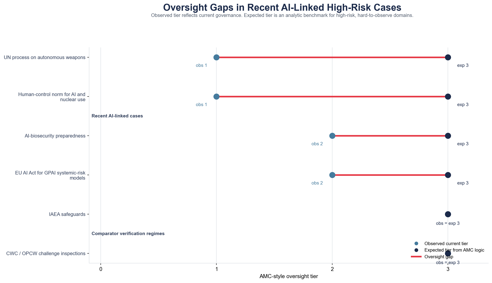

# When Promises Aren't Enough: What 80 Years of Arms Control Can Teach AI Governance

*AMC Research Sprint | April 2026 · Alva Myrdal Centre for Nuclear Disarmament, Uppsala University*

---

Not all oversight is created equal. While a nation may sign an agreement stating its intent never to produce bioweapons, the commitment carries significant weight. But when this commitment can be backed by surprise inspections, its significance becomes even greater. The gap between the two scenarios is no minor technical distinction. It is the very essence of how international governance really operates.

For eight decades, arms control has tried to answer precisely that question. What situations require assurances, what require reports, and what require an agent with access clearance and credentials. The answers can be seen empirically in the evidence and they have very real implications for AI governance.

---

## The Compliance Spectrum: Four Tiers, Very Different Guarantees

The AMC Arms Control Agreements Database consists of 128 treaties that range from 1817 to 2021. Within these treaties, there are four types of oversight based on their sensitivity level, with each being a unique form of governance assurance:

- **None** : the agreement relies entirely on political goodwill. No reporting, no inspection, no review body of any kind.

- **Low (Consultation)** : parties meet to discuss compliance concerns. No binding checks, no external observer.

- **Medium (Demonstrated compliance)** : states submit reports on their own activities. Self-reported data; independent verification not required.

- **High (Verified compliance)** : an independent third party checks. This is the IAEA model, the OPCW model: inspectors with access rights, not just reports from the parties themselves.

First and foremost, the most surprising finding from the data presented is that almost **40% of all arms control treaties are managed without any form of supervision whatsoever.** It is entirely based on the good faith of the participants involved. Such a decision was not made by mistake; rather, it was a political decision. However, it is also an insecure one. If the relationship between the two parties deteriorates, it is the first agreement that will be compromised. The ABM Treaty, which was revoked by the US in 2002. The INF Treaty, which was revoked in 2019.

---

## The Pattern: High Stakes, High Oversight

The second finding is the one that matters most for AI governance.

**States only accept intrusive verification when the cost of undetected cheating is catastrophic.**

This is not a prescriptive statement; rather, it is an empirical observation. Treaties concerning biological and chemical weapons receive the highest scores for their oversight sensitivity. Similarly, agreements concerning strategic nuclear delivery systems, such as ICBMs, SLBMs, and heavy bombers, receive the highest scores. This is because with those weapons, a single violation goes unpunished, resulting in irreparable consequences.

The oversight sensitivity concerning conventional weapons is considerably lower. In the latter case, the potential violations are easier to discover and fix, and the political cost associated with inspections surpasses its benefits. Therefore, states tend to accept compliance and opt for reporting violations themselves.

The trends outlined above remain consistent over the period of almost eighty years and with all weapon categories included into the dataset.

---

## The Cold War Peak and What Happened After

The verified compliance era has a history, and it is concentrated in a specific geopolitical window.

During the 1970s-1990s that the peak period of verified compliance agreements occurred. Treaty acronyms from the Cold War: SALT, ABM, INF, START, CFE, CWC  each of them contributing to the infrastructure of independent inspection. In the 1990s alone there were 17 new verified compliance agreements created.

After the year 2000: 0 new verified compliance agreements for the whole decade. In the 2010s, two.

It is not about some slow decline. Change-point analysis reveals two clear structural breaks for the annual verified compliance series - years 1989 and 1997. It identifies the start (1989) and end (1997) points of the peak.

Year 1989 is the starting point of the surge of arms control after the end of the Cold War. Year 1997 is its end point. After Ottawa (1997) and CTBT (1997) there is no more pipeline. There was a certain geopolitical window for the creation of strong compliance infrastructure, which closed.

---

## What Predicts High Oversight Sensitivity?

Three statistical analyses validate and deepen the descriptive pattern.

**Logistic regression** on the full dataset (128 agreements, controlling for treaty year, coalition size, laterality, and weapon category) identifies two robust predictors of high-sensitivity oversight:

Strategic delivery weapon type and number of signatories are the only two predictors whose bootstrap confidence intervals do not cross zero across all 300 resamples. The bilateral agreement conclusion is surprising: multilateral agreements are, in fact, *more difficult* to oversee than bilateral ones. History’s most rigorous verification regimes, the Strategic Arms Reduction Treaty, Intermediate-Range Nuclear Forces Treaty, and Anti-Ballistic Missile Treaty, were bilateral treaties designed by two opposing parties who had everything to lose if they cheated and no other means of discovering whether they did. Multilateral agreements tend to compromise at consultation.

**Hierarchical clustering** seeks to determine if clusters arise naturally in the data that match the four oversight categories, even when those categories are not predefined. The answer is partly affirmative: high-sensitivity treaties can be clustered with statistical certainty at 83% purity. The remaining three categories blend together. The divide between “some oversight” and “independent third-party inspection” is wider than any between the other categories.

---

## How the Pattern Maps to AI Governance

Present-day AI governance is placed on the lower to middle scale of sensitivity with respect to the level of oversight. The levels of consultation and demonstrated compliance through voluntary pledges, model cards, self-reporting by industry, and evaluation procedures are part of arms control. Based on arms control data, this appears inadequate for the riskiest systems.

Three lessons follow directly from the empirical pattern.

- **First: oversight by tier to risk.** Save your intrusive methods for the systems that represent the greatest risks. More limited means of oversight for lower-risk systems can avoid political backlash while still being effective. It would have been a mistake to apply IAEA-level verification in arms control.

- **Second: construct verification capability ahead of time.** The IAEA was created way back in 1957, before verification became absolutely necessary. Interpretability testing would be the nearest equivalent to a challenge inspection within the context of AI technology: just like how the inspectors ask for access to facilities outside the declared scope whenever a violation is suspected, interpretability techniques have to be able to access more information from the internal workings of the machine than those provided willingly by the designers.

- **Third: Norms without enforcement mechanisms are fragile.** Almost forty percent of arms control treaties depend only on goodwill. These treaties endure as long as the political bond that sustains them endures. AI regulatory architectures that depend exclusively on voluntary adherence share the same inherent weakness.

---

## Applying the Rubric: Where Does AI Governance Stand Today?

The AI oversight sensitivity model can be applied straightforwardly to contemporary AI-related governance tools by measuring each one relative to the very same criteria set for arms control agreements.

It is evident that, in four high-risk AI governance scenarios, the average oversight sensitivity rating is **Low-to-Medium**, while the expected rating for catastrophic and hard-to-detect failure cases is **High**.

| Case | Domain | Observed Sensitivity | Expected | Gap |
|------|--------|---------------------|----------|-----|
| UN autonomous weapons process [1][2] | Autonomous weapons | Low - consultation only | High | −2 tiers |
| AI-biosecurity preparedness [3][4] | AI-biosecurity | Medium - demonstrated | High | −1 tier |
| EU AI Act - GPAI systemic risk [5][6] | Frontier AI | Medium - demonstrated | High | −1 tier |
| Human-control norm, AI and nuclear use [7] | Nuclear decision environments | Low - consultation only | High | −2 tiers |
| **IAEA safeguards** *(benchmark)* [8] | Nuclear safeguards | High - verified | High | Aligned |
| **CWC/OPCW** *(benchmark)* [9][10] | Chemical weapons | High - verified | High | Aligned |

These two areas are of greatest concern. Autonomous weapons and AI in nuclear decision-making environments have received only consultation-level oversight, despite their most catastrophic potential. The two stronger examples are AI biosecurity and the EU AI Act, which do include structured assessment and reporting requirements, but are still not achieving the access requirement, the right of an outside party to request inspection above and beyond that provided by either the developer or state. The CWC included such a requirement back in 1993. The IAEA AP included it in 1997.

---

## A Case Study in What the Gap Looks Like

On February 28, 2026, an attack by missiles obliterated the Shajareh Tayyebeh Girls' Elementary School in Minab, Iran. About 165 children lost their lives in this attack. The perpetrators of this crime are still under dispute several months later. Although Iran has accused the United States and Israel for this attack, the US government has denied any intent to target this particular school in its military operation. Various reports on social media that have suggested the involvement of Iran itself in an own-strike attack have been debunked by investigative bodies like Bellingcat, the New York Times, and the Washington Post, which suggest a Tomahawk missile from the US side, even if there has not been any official claim yet.

Some expert commentary has raised the question of whether AI-assisted targeting systems contributed to the strike, which remains unconfirmed speculation and is not an established fact.

The governance conclusion that is drawn is that: **there is no independent verification architecture that has access to the targeting databases, strike approval chains, and AI algorithm inputs.** It is impossible to know whether AI was used for this particular event, as there is no framework for verifying whether this was the case.

This is a practical example of what it means when a weapon is governed with a low-sensitivity governance regime. There is a political principle that humans will control any lethal autonomous decisions made. No verification architecture can check whether this was the case following an incident. This is similar to how it was impossible to verify the use of chemical weapons before the OPCW existed, prior to 1993.

> *The Minab strike is cited solely to illustrate the governance gap:- the absence of any mechanism that could determine what happened. AI involvement in targeting is not confirmed and is not asserted here. Sources: UK Fact Check Politics, March 2026; Snopes, March 3 2026; FactCheck.org, March 10 2026; AP News; PolitiFact, March 1 2026.*

---

## The Rule Arms Control Learned

Eight decades of treaties established one basic principle: In cases where mistrust is high and stakes are great, verification is not an option; it is the system. The framework for reliable enforcement must be constructed before the emergency that necessitates it, in the geopolitical window that renders it politically feasible.

That window has opened for artificial intelligence governance. The 2000s in arms control reveal what happens when the window slams shut.

---

> **The history of arms control suggests a simple rule: where trust is low and stakes are high, verification is not optional. It is the system.**

---

*Analysis based on the AMC Arms Control Agreement Database V2 (128 agreements, 1817–2021). Research conducted as part of the AMC Research Sprint on Arms Control and AI Governance, April 2026, Alva Myrdal Centre for Nuclear Disarmament, Uppsala University.*

---

## References

[1] United Nations General Assembly, *Lethal autonomous weapon systems*, A/RES/78/241, 22 December 2023. https://digitallibrary.un.org/record/4033027?ln=en&v=pdf  
[2] United Nations Secretary-General, *Lethal autonomous weapon systems*, A/79/88, 1 July 2024. https://digitallibrary.un.org/record/4059475/files/A_79_88-EN.pdf  
[3] OpenAI, *Preparing for future AI capabilities in biology*, 18 June 2025. https://openai.com/index/preparing-for-future-ai-capabilities-in-biology/  
[4] *International AI Safety Report 2025*, 29 January 2025. https://internationalaisafetyreport.org/publication/international-ai-safety-report-2025  
[5] European Union AI Act Service Desk, Article 55, obligations for general-purpose AI models with systemic risk. https://ai-act-service-desk.ec.europa.eu/en/ai-act/article-55  
[6] European Commission, FAQ on general-purpose AI models and systemic risk under the AI Act. https://digital-strategy.ec.europa.eu/en/faqs/general-purpose-ai-models-ai-act-questions-answers  
[7] CNBC, reporting on the Biden-Xi November 2024 statement on human control over nuclear-use decisions, 17 November 2024. https://www.cnbc.com/2024/11/17/biden-xi-agree-that-humans-not-ai-should-control-nuclear-arms.html  
[8] International Atomic Energy Agency, *Safeguards explained*. https://www.iaea.org/topics/safeguards-explained  
[9] Organisation for the Prohibition of Chemical Weapons, *Chemical Weapons Convention* overview. https://www.opcw.org/chemical-weapons-convention/  
[10] Organisation for the Prohibition of Chemical Weapons, *Verification Annex, Part X: Challenge inspections*. https://www.opcw.org/chemical-weapons-convention/annexes/verification-annex/part-x-challenge-inspections-pursuant
